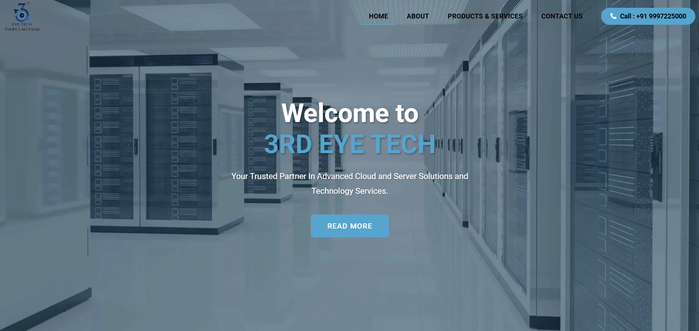
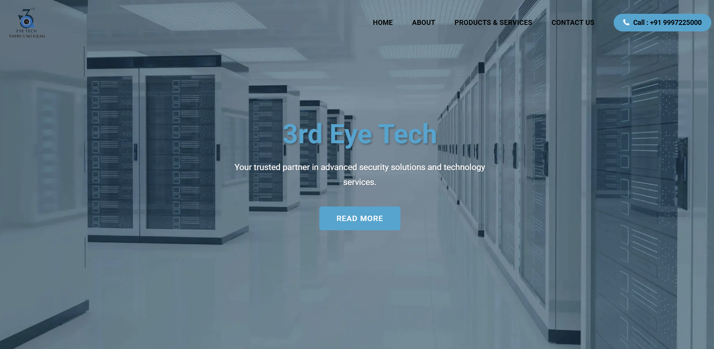
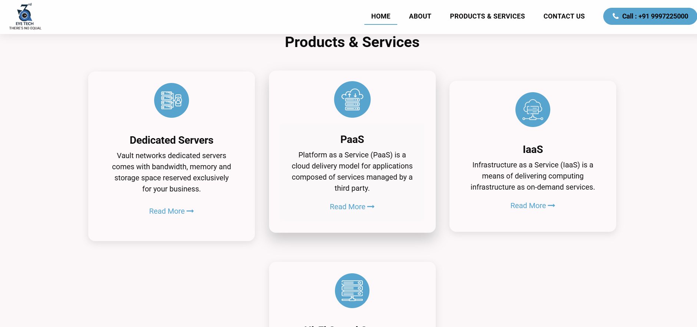
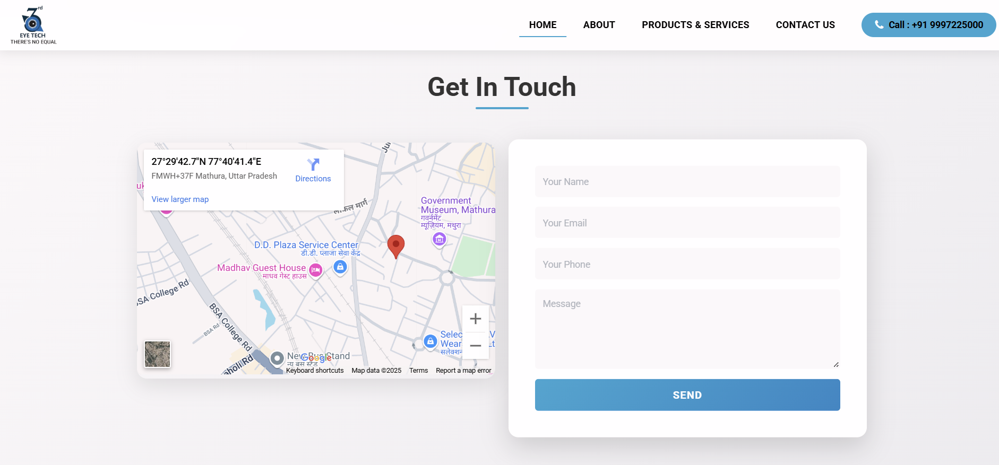
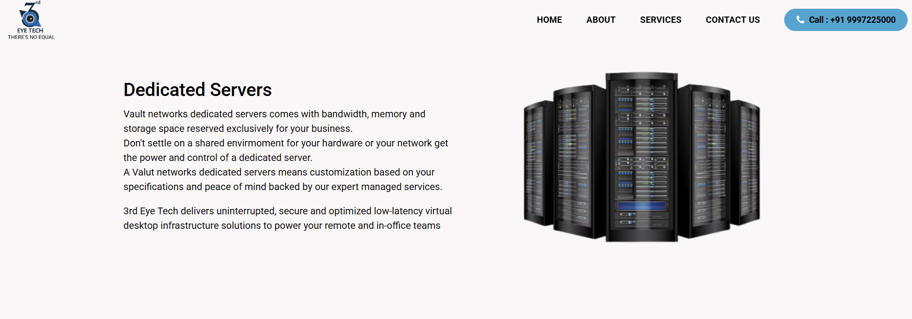
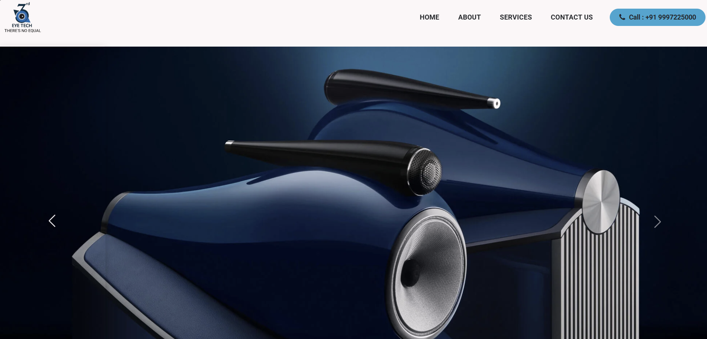
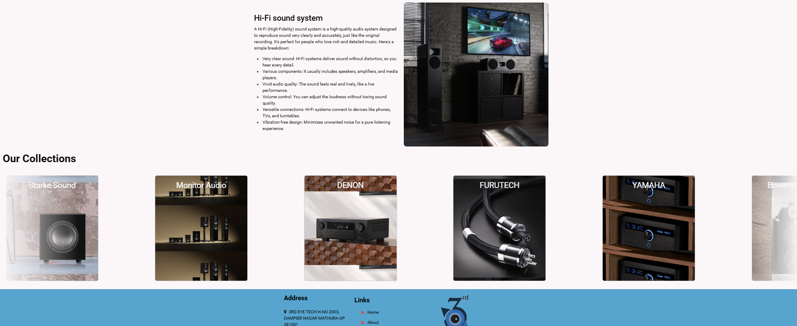
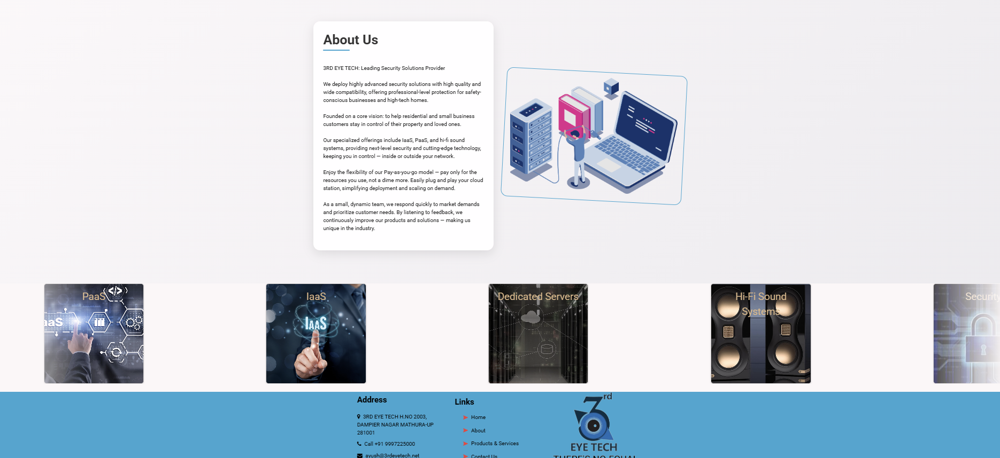
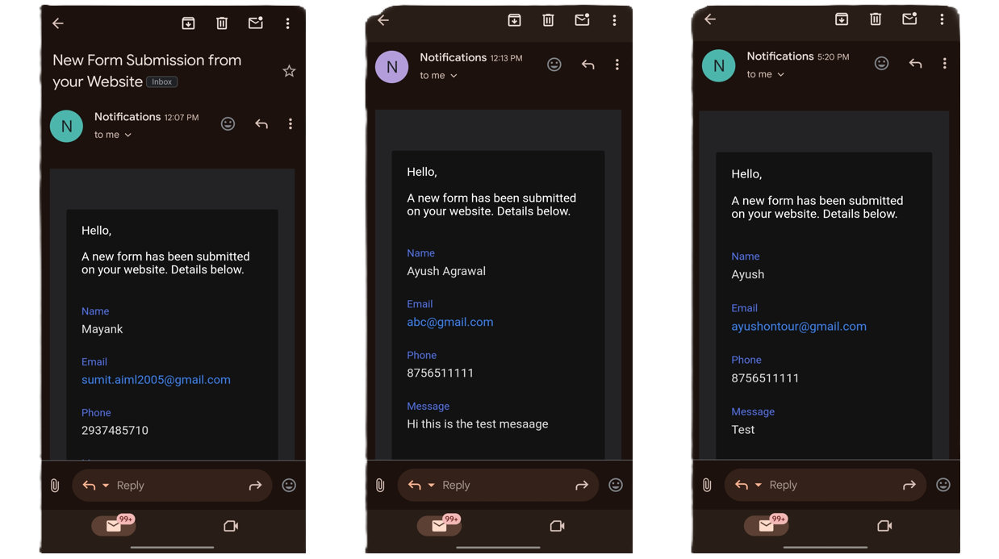

# 3rd Eye Tech - Informative Website

  

## 🚀 About the Project
This is a professionally designed **informative website** for **3rd Eye Tech**, a tech service provider specializing in:

- ✅ **Dedicated Servers** – Reliable and secure hosting solutions
- ✅ **PaaS & IaaS** – Scalable platforms and infrastructure
- ✅ **High-End Sound Systems** – Premium audio setups worth ₹1-2 crores

The website effectively showcases their services and brand identity in a sleek, user-friendly design.

---

## 🛠️ Tech Stack Used

- **Frontend:** HTML, CSS, JavaScript
- **Email Integration:** Web3Forms (for seamless contact functionality)
- **Methodology:** Agile (with daily scrum meetings for progress tracking)

---

## 📸 Screenshots

### 🔹 Homepage


### 🔹 Services Page


### 🔹 Contact Page


### 🔹 Server Page


### 🔹 Sound Page


### 🔹 Sound Page


### 🔹 About Page


### 🔹 E-mail confirmation


---

## 🎯 Features

✔️ Clean and modern UI/UX design  
✔️ Fully responsive across devices  
✔️ Seamless contact form with **Web3Forms** integration  
✔️ Fast and optimized performance  

---

## 📂 Folder Structure
```
📦 3rdEyeTech-Website
├── 📂 assets/            # Images, icons, and media files
├── 📂 css/               # Stylesheets
├── 📂 js/                # JavaScript files
├── 📂 fonts/            # Amazing fonts for good written content
├── 📂 screenshots/       # Project screenshots
├── 📜 index.html         # Main homepage file
├── 📜 README.md          # Project documentation
└── ... (other files)  
```

---

## 🚀 Deployment
The website can be deployed easily using **cent OS** on **Red Hat** based Server,

---
💻 **Developed by:** [**SUMIT**]
